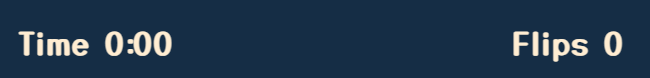
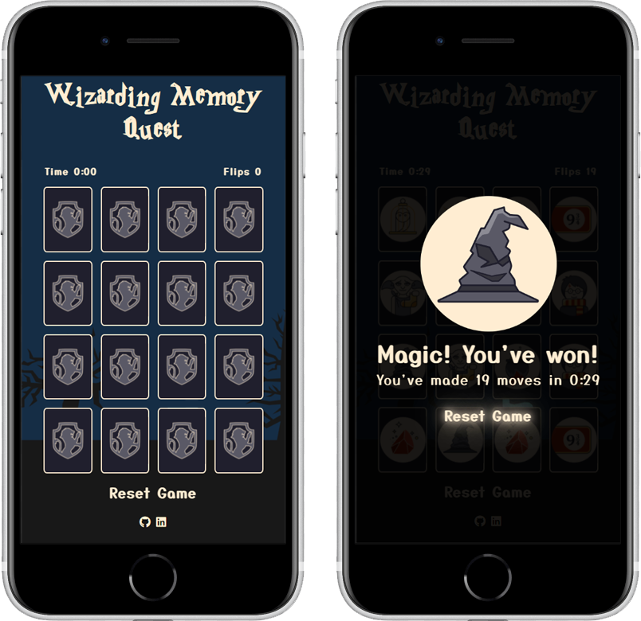

# Portfolio Project 2 - Interactive front-end site <!-- omit in toc -->

## Wizarding Memory Quest <!-- omit in toc -->

## Live Site <!-- omit in toc -->

[Wizarding Memory Quest](https://darioc18.github.io/memory-game/)

## Repository <!-- omit in toc -->

https://darioc18.github.io/memory-game/

## Brief

Wizarding Memory Quest is an enchanting Harry Potter-themed card-matching game. With 16 designed cards, players must rely on their memory and wits to find matching pairs. The rules mirror those of the classic memory card game, making it easy for both Harry Potter fans and new players to dive right in. Race against the clock and aim for the fewest moves to become a true wizarding champion.

## User Stories

Target User for "Wizarding Memory Quest":

- Harry Potter fan and enthusiast
- Familiar with card-matching games and memory-based challenges
- Seeks a visually appealing and captivating game with Harry Potter-themed elements
- Appreciates nostalgia and escape into the magical world
- Enjoys testing memory skills in a casual yet engaging gameplay
- Interested in a positive and inviting gaming experience with intuitive mechanics
- Interested in competing with others

## Design

### Wireframes

Presented below are a series of wireframes illustrating the game's visual representation across a computer webpage and a mobile screen.

### Colours

For the color palette, I drew inspiration from the existing color palette used in the images of the cards. This allowed me to create a harmonious and cohesive set of colors for the game.
I created a visual palette by using [coolors.co](https://coolors.co).

### Typography

I chose to incorporate two fonts in the design; one for the title, which draws inspiration from Harry Potter's popular font, evoking a sense of nostalgia and familiarity, and a suitable Google font that complements the game's visual style:

- Google fonts: [Yusei Magic](https://fonts.google.com/?query=yusei+magic)
  
- CDN fonts: [Harry Potter Font Family](https://www.cdnfonts.com/harry-potter.font)
  

### Imagery

The images on the cards were sourced from free downloads available at [freebbble icon set](http://freebbble.com/harry-potter-icon-set/), and I specifically chose them due to their simple and captivating style.
The back of the cards was designed in Photoshop, utilizing the same color palette as the front images to maintain a consistent and cohesive visual style. This design choice ensures that the card elements seamlessly blend together, enhancing the overall aesthetic appeal of the game.

## Features

The game comprises two pages: the main page featuring a grid of 16 cards and a popup win game screen.

### The Grid

On the main page, players can flip the cards by clicking on them, revealing the images behind. When two flipped cards do not match, they automatically flip back to their original position. However, upon finding a match, the cards remain flipped, allowing the user to continue and search for new matches. This mechanic engages players and challenges their memory skills.

### Time and Flips

Clicking on the first card activates the timer, and the flips tracker records every instance when the user flips two cards.

### Restart option

Players have the option to restart the game by clicking the reset button, either on the main window or the win pop-up screen. Upon restarting, both the timer and the flip counter are reset to zero, providing users with a fresh start for a new round of magical memory challenges.

### Win pop-up screen

When the user successfully flips all the matching cards, a semi-transparent win pop-up window displays the time taken to complete the game and the number of flips made. This feature adds a sense of challenge, encouraging players to aim for quicker completion times and fewer moves to achieve the best possible results.

### Potential Features

The following features could be implemented in the future:

- Introducing different game levels with a countdown mode and increased difficulty to offer more challenging and engaging gameplay experiences.
- Providing the option for users to save their scores on a leaderboard, fostering a competitive spirit

## Responsive Design

This game is intended for mobile devices and other platforms, so it has been designed with responsiveness in mind. This ensures that the game's grid structure layout remains consistent across various devices, including desktop, laptop, tablet, and mobile, on both portrait and landscape mode, without compromising its visual appeal.

## Accessibility

Throughout the coding process of this website, great attention has been given to making it as accessible-friendly as possible. This has been achieved by implementing the following measures:

- Using semantic HTML: By utilizing semantic HTML elements, such as `<header>`, `<main>`, `<footer>`, and others, the structure and purpose of the content are accurately conveyed.

- Providing alt attributes for every picture: By including descriptive alt attributes for all images on the website.

- Adding aria-label to anchor elements: The use of aria-label attributes for link and icons enhances accessibility by providing additional information or descriptions that are not explicitly conveyed through visual elements alone.

With these considerations, I aimed to make the website more accessible and user-friendly.

## Testing

Please refer to the [TESTING.md](TESTING.md) file for all test-related documentation.
