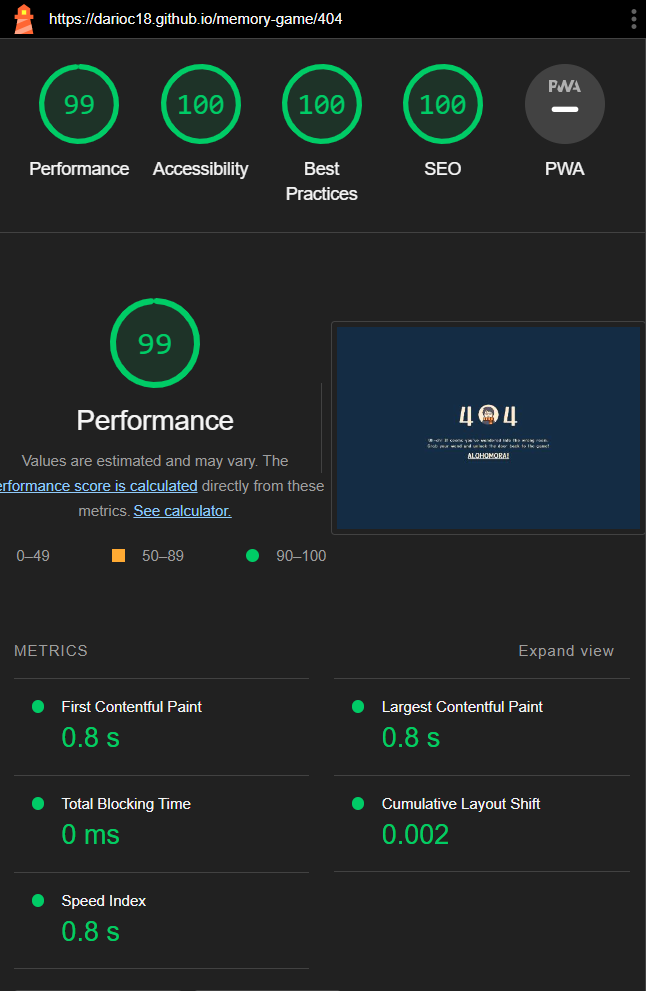

# Testing

In order to confirm the correct functionality:

- Testing has been conducted on multiple browsers, including Chrome, Firefox, and Edge, ensuring that the website appears and functions as intended in each of them.
- The responsive design has been tested using the developer tools option, ensuring that the website dynamically adjusts and adapts across various screen sizes (the style.css file contains multiple media queries, ensuring an optimal user experience across various devices and screen sizes.).

## Manual Testing

| Page                          | Action                                     | Expected Result                                                                                                 | Tested | Passed |
| ----------------------------- | ------------------------------------------ | --------------------------------------------------------------------------------------------------------------- | ------ | ------ |
| Homepage                      | Click on a card.                           | The card should flip and reveal the image on the other side.                                                    | ✔      | ✔      |
| Homepage                      | Click on the first card                    | The time starts running.                                                                                        | ✔      | ✔      |
| Homepage                      | Click on any two cards                     | The flip counter increments by 1                                                                                | ✔      | ✔      |
| Homepage                      | Click on two matching cards                | Both cards will remain in the flipped position.                                                                 | ✔      | ✔      |
| Homepage                      | Click on two different cards               | After clicking on the second card, both cards will flip back to their original position.                        | ✔      | ✔      |
| Homepage                      | Click on the 'Reset' button                | Both the timer and the flip counter are reset to zero, providing users with a fresh start                       | ✔      | ✔      |
| Homepage footer               | Click on the 'GitHub' and 'Linkedin' icons | The user is redirected to the corresponding GitHub or Linkedin profile in another tab                           | ✔      | ✔      |
| Homepage / Win overlay screen | Flip all the matching cards                | A semi-transparent win pop-up window displays the time taken to complete the game and the number of flips made. | ✔      | ✔      |
| Win overlay screen            | Click on the 'Reset' button                | The user gets redirected to the home page and both the timer and the flip counter are reset to zero             | ✔      | ✔      |
| 404 page                      | Click on the 'Alohomora' button            | The user gets redirected to the home page and can start a new game                                              | ✔      | ✔      |

## Validator testing

The website has been run through the W3C Markup validation service CSS validation service, and JSHint:

- Homepage

  - HTML: No errors were returned when passing through the official [W3C HTML validator](https://validator.w3.org/nu/?doc=https%3A%2F%2Fdarioc18.github.io%2Fmemory-game%2F)
  - CSS: No errors were returned when passing through the official [W3C CSS validator](https://jigsaw.w3.org/css-validator/validator?uri=https%3A%2F%2Fdarioc18.github.io%2Fmemory-game%2F&profile=css3svg&usermedium=all&warning=1&vextwarning=&lang=en)
  - Javascript: No errors were returned when passing through the official

    

- 404 Page
  - HTML: No errors were returned when passing through the official [W3C HTML validator](https://validator.w3.org/nu/?doc=https%3A%2F%2Fdarioc18.github.io%2Fmemory-game%2F404)

## Lighthouse

Google Lighthouse in Google's Chrome Developer Tools was used to test the performance of the website. All elements performed well.

- Homepage:

  

- 404 Page:

  
