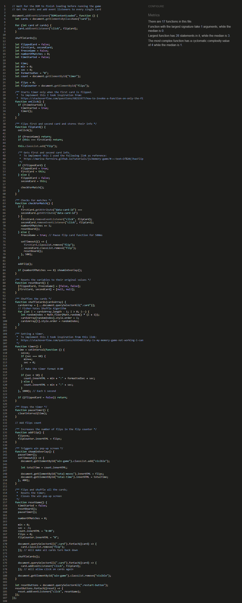
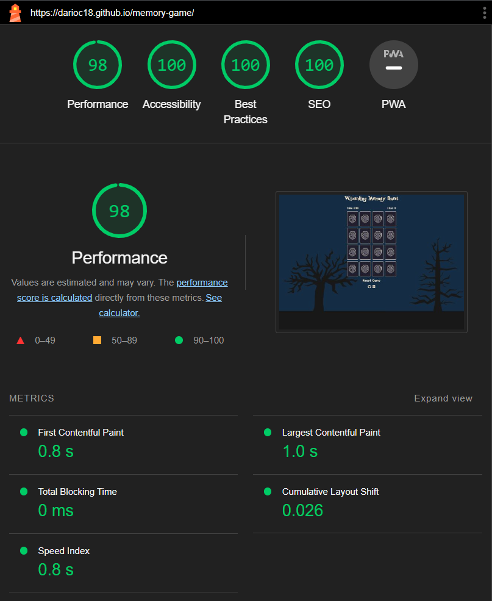

# Testing

In order to confirm the correct functionality:

- Testing has been conducted on multiple browsers, including Chrome, Firefox, and Edge, ensuring that the website appears and functions as intended in each of them.
- The responsive design has been tested using the developer tools option, ensuring that the website dynamically adjusts and adapts across various screen sizes (the style.css file contains multiple media queries, ensuring an optimal user experience across various devices and screen sizes.).

## Manual Testing

| Page                          | Action                       | Expected Result                                                                                                 | Tested | Passed |
| ----------------------------- | ---------------------------- | --------------------------------------------------------------------------------------------------------------- | ------ | ------ |
| Homepage                      | Click on every single card.  | The card should flip and reveal the image on the other side.                                                    | ✔      | ✔      |
| Homepage                      | Click on the first card      | The time starts running.                                                                                        | ✔      | ✔      |
| Homepage                      | Click on any two cards       | The flip counter increments by 1                                                                                | ✔      | ✔      |
| Homepage                      | Click on two matching cards  | Both cards will remain in the flipped position.                                                                 | ✔      | ✔      |
| Homepage                      | Click on two different cards | After clicking on the second card, both cards will flip back to their original position.                        | ✔      | ✔      |
| Homepage                      | Click on the 'Reset' button  | Both the timer and the flip counter are reset to zero, providing users with a fresh start                       | ✔      | ✔      |
| Homepage / Win overlay screen | Flip all the matching cards  | A semi-transparent win pop-up window displays the time taken to complete the game and the number of flips made. | ✔      | ✔      |
| Win overlay screen            | Click on the 'Reset' button  | The user gets redirected to the home page and both the timer and the flip counter are reset to zero             | ✔      | ✔      |

## Validator testing

The website has been run through the W3C Markup validation service CSS validation service, and JSHint:

- HTML: No errors were returned when passing through the official [W3C HTML validator](https://validator.w3.org/nu/?doc=https%3A%2F%2Fdarioc18.github.io%2Fmemory-game%2F)
- CSS: No errors were returned when passing through the official [W3C CSS validator](https://jigsaw.w3.org/css-validator/validator?uri=https%3A%2F%2Fdarioc18.github.io%2Fmemory-game%2F&profile=css3svg&usermedium=all&warning=1&vextwarning=&lang=en)
- Javascript: No errors were returned when passing through the official
  

  ## Lighthouse

  Google Lighthouse in Google's Chrome Developer Tools was used to test the performance of the website. All elements performed well.
  

  ## Bugs

  | N.  | Bug                                                                                                                                                                                                                                                                                                 | Solution                                                                                                                                                                                                                                                                          |
  | --- | --------------------------------------------------------------------------------------------------------------------------------------------------------------------------------------------------------------------------------------------------------------------------------------------------- | --------------------------------------------------------------------------------------------------------------------------------------------------------------------------------------------------------------------------------------------------------------------------------- |
  | 1   | My aim was to initiate the timer when the user clicked on the first card, so I inserted the `function timer()` within the `function flipCard()`. However, I noticed that the timer malfunctioned, accelerating each time I clicked on every other card.                                             | I found a solution on [Stack Overflow](https://stackoverflow.com/questions/68211977/how-to-invoke-a-function-on-only-the-first-click). By creating a boolean variable and implementing a check within the timer function, the issue was fixed, ensuring the timer worked properly |
  | 2   | I encountered a bug related to background images. I chose to include the background images through CSS instead of HTML, as I planned to update the image for specific media queries. However, I faced some issues in controlling the size and position of the background images using `object-fit`. | I used `background-size`, which specifically manages background elements in CSS. Unlike `object-fit`, which applies only to HTML `` elements.                                                                                                                                |
  | 3   | Clicking on the last two matching cards triggered the win screen to appear before the card flipping animation was completed.                                                                                                                                                                        | To resolve this issue, I implemented a solution using the `setTimeout` global function. By introducing a delay, I ensured that the win pop-up screen would only appear after the card flipping animation had finished.                                                            |
